# Enterprise DevSecOps & GitOps Architecture: Multi-Cloud K3s Mesh

## Project Overview
This project is a comprehensive, production-grade implementation of a Level 4 DevSecOps and GitOps pipeline. I utilized Google's open-source 10-tier **Online Boutique microservices architecture** as the target application to demonstrate how to secure, automate, deploy, and monitor a complex, distributed system across a true Multi-Cloud Hybrid Kubernetes Mesh.

I engineered a custom K3s Kubernetes cluster that spans across **Oracle Cloud Infrastructure (OCI)** and **Microsoft Azure**. The pipeline enforces strict security and quality gates at every stage of the software development lifecycle, culminating in a fully automated Disaster Recovery (DR) vault and a simulated Chaos Engineering resilience test.

---

## Architecture Diagram

---

## Phase 1: The Multi-Cloud Kubernetes Mesh
Instead of a standard single-provider cluster, I engineered a highly distributed infrastructure to mimic enterprise hybrid-cloud environments.

### 1. CI/CD Control Plane (Microsoft Azure)
I provisioned a high-performance Linux Virtual Machine on Microsoft Azure to act as the centralized "Mission Control" for the build pipeline, hosting Jenkins, SonarQube, Trivy, and the Docker daemon.

### 2. Production K3s Mesh (Oracle Cloud & Azure)
* **Control Plane (Oracle Cloud - `oracle2`):** The master node and Kubernetes API server are hosted on Oracle Cloud, acting as the centralized brain of the cluster.
* **Worker Node 1 (Oracle Cloud - `oracle1`):** A dedicated worker node residing within the same cloud provider for localized, low-latency compute.
* **Worker Node 2 (Microsoft Azure - `azure-node`):** A cross-cloud worker node provisioned on Microsoft Azure. This required configuring strict network security groups (NSGs), firewall rules, and cross-cloud networking to allow the Azure worker to securely join the Oracle control plane over the public internet.

This multi-cloud mesh ensures that if an entire cloud provider region experiences an outage, the cluster architecture can theoretically survive by shifting workloads to the surviving provider's nodes.

---

## Phase 2: Continuous Integration & "Shift-Left" Security
The CI/CD pipeline is orchestrated by Jenkins and triggered automatically via GitHub Webhooks. Before any code is allowed to compile, it passes through rigorous "Shift-Left" security gates.

1. **Source Code & IaC Scanning (Trivy):** The pipeline first executes a filesystem scan using Trivy. It analyzes the raw source code and Kubernetes YAML manifests to detect misconfigurations and exposed hardcoded secrets.
2. **Static Application Security Testing (SonarQube):** The microservice code is analyzed by SonarQube. I established a strict **Quality Gate**—if the code contains critical vulnerabilities or drops below coverage thresholds, the pipeline immediately fails.
3. **Containerization & Image Scanning:** Once the code passes, Docker builds the lightweight microservice images. Before pushing them to Docker Hub, Trivy executes a deep-dive vulnerability scan on the compiled OS layers to catch critical CVEs.

**Visual Proof:**
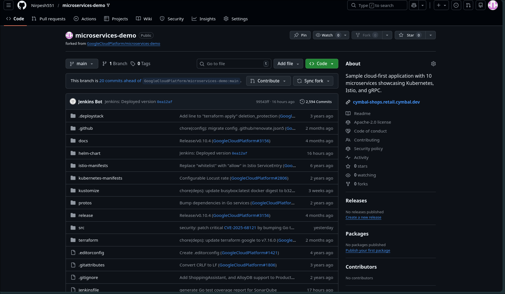
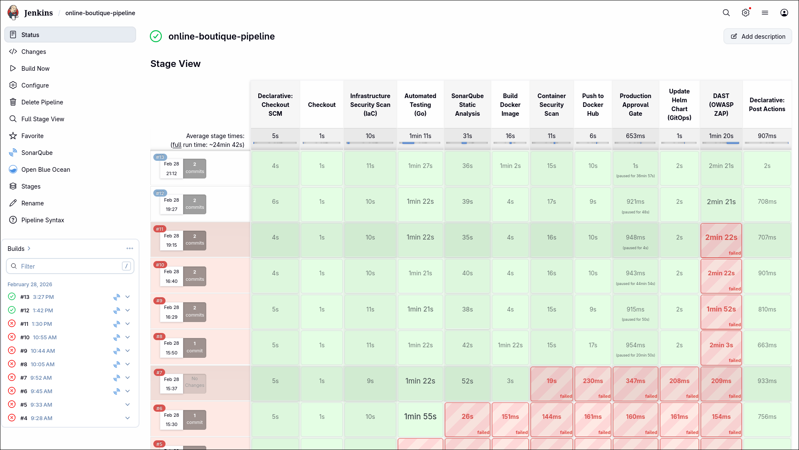
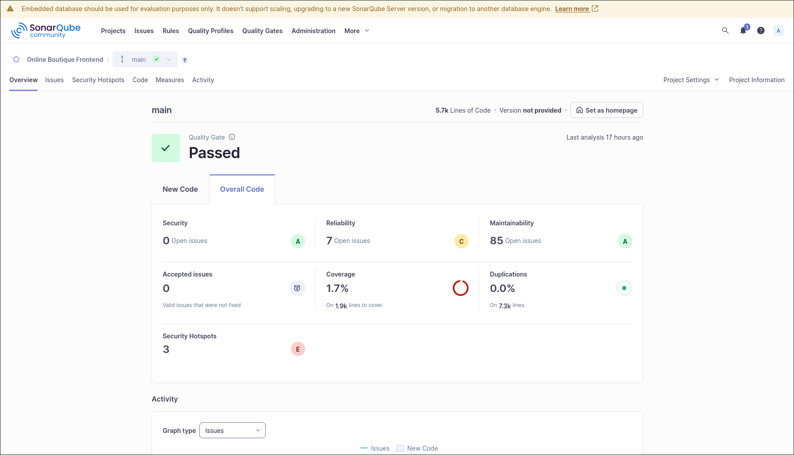
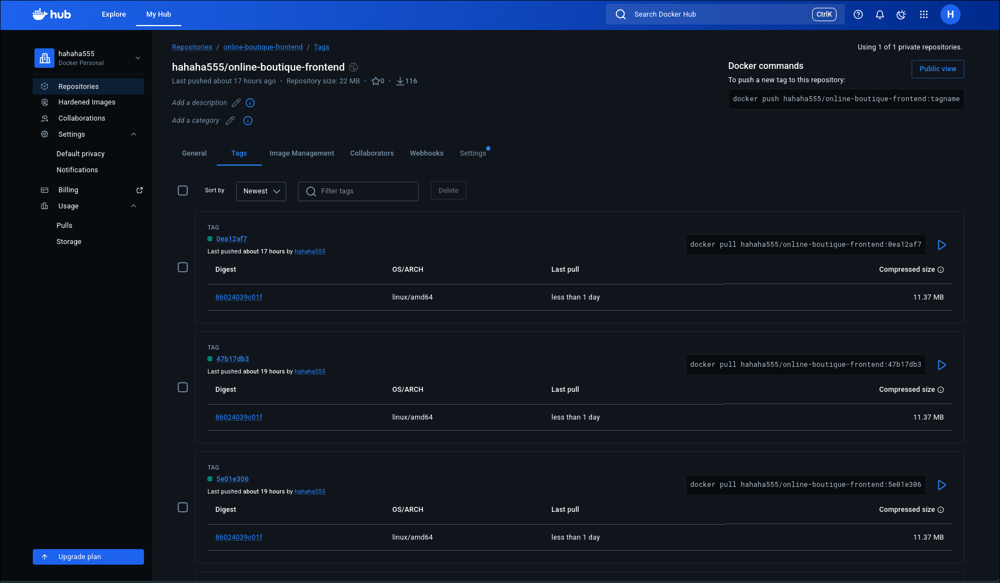
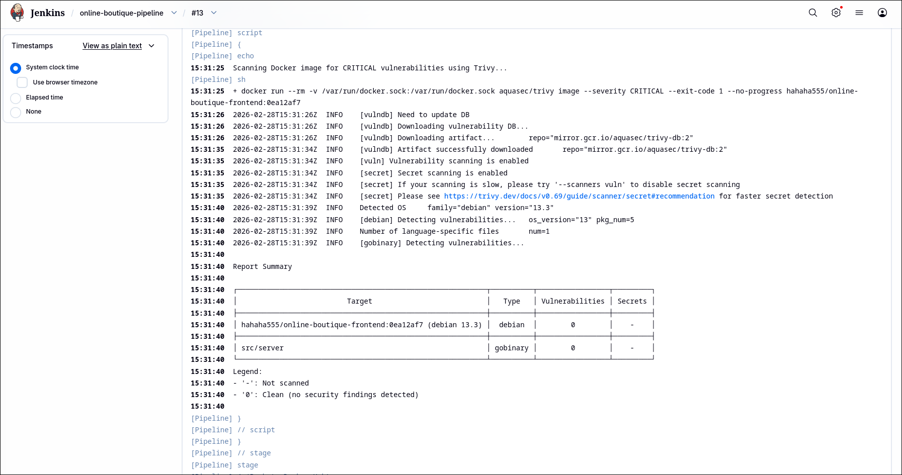

---

## Phase 3: ChatOps & Declarative GitOps (ArgoCD)
To prevent blind automated deployments to production, I engineered a Human-in-the-Loop approval system combined with a declarative GitOps pull-model.

1. **Slack ChatOps:** Jenkins sends real-time build reports to a Slack channel. The pipeline securely pauses, requiring a DevOps engineer to review the security scans and manually click "Approve".
2. **GitOps Manifest Updates:** Upon approval, Jenkins acts as a GitOps Bot, using recursive `sed` commands to dynamically update the image tags directly in the GitHub repository's manifest files.
3. **ArgoCD Synchronization:** ArgoCD, running natively inside the multi-cloud K3s cluster, continuously monitors the GitHub repo. Upon detecting the new commit, ArgoCD initiates a **Zero-Downtime Rolling Update**, gracefully replacing old pods across both the Azure and Oracle worker nodes.

**Visual Proof:**
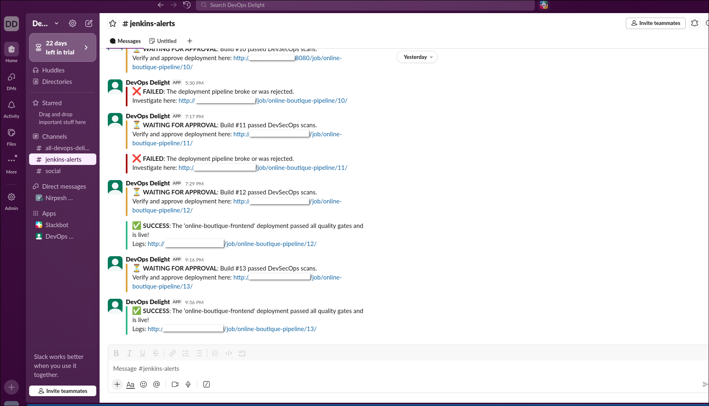
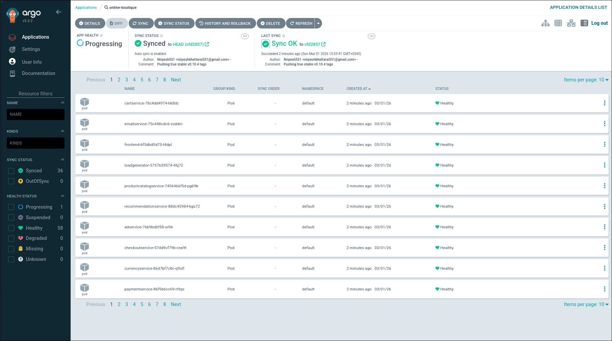

---

## Phase 4: Observability & Dynamic Security (DAST)
The pipeline verifies the application dynamically in its running state and provides continuous visibility.

1. **Prometheus & Grafana:** I deployed the `kube-prometheus-stack` to the cluster. Prometheus actively scrapes metrics from the distributed nodes, while Grafana visualizes CPU utilization, memory quotas, and pod network traffic in real-time.
2. **Dynamic Application Security Testing (OWASP ZAP):** Once deployed, Jenkins spins up a containerized OWASP ZAP instance attached to the host network. ZAP actively attacks the live production URL to detect runtime vulnerabilities. This was engineered as a *non-blocking* step with a fail-safe echo to prevent temporary cloud network timeouts from failing a healthy deployment.

**Visual Proof:**
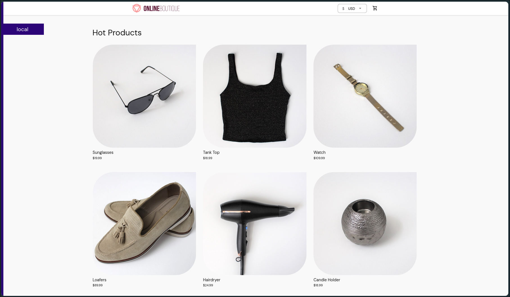
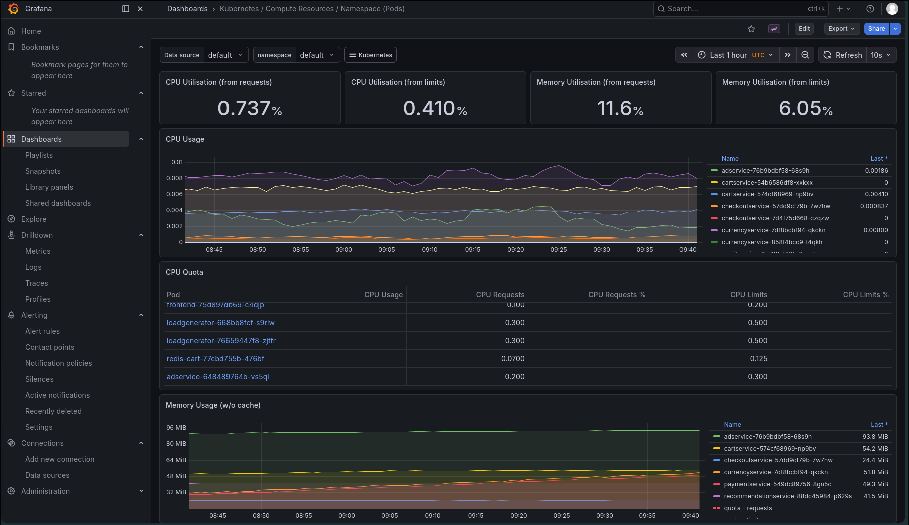
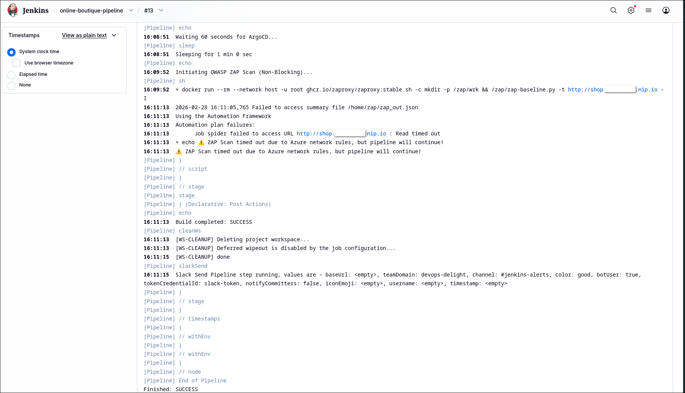

---

## Phase 5: SRE, Chaos Engineering & Disaster Recovery
To ensure business continuity against catastrophic failures, I engineered an in-cluster disaster recovery solution.

1. **The S3 Vault:** I deployed **MinIO** directly into the cluster to act as a private, S3-compatible object storage vault.
2. **Velero Backup Engine:** Velero was configured with a native Kubernetes CronJob to automatically snapshot the entire cluster state and persistent volumes every night at 2:00 AM (`0 2 * * *`).
3. **The Chaos Test:** To validate the DR architecture, I deliberately simulated a total datacenter loss by executing: `kubectl delete deployments,services,replicasets --all -n default`.
4. **The Resurrection:** I executed a `velero restore` command. Velero reached into the MinIO vault and successfully resurrected the entire 10-tier microservice architecture across the multi-cloud worker nodes in under 60 seconds.

**Visual Proof:**
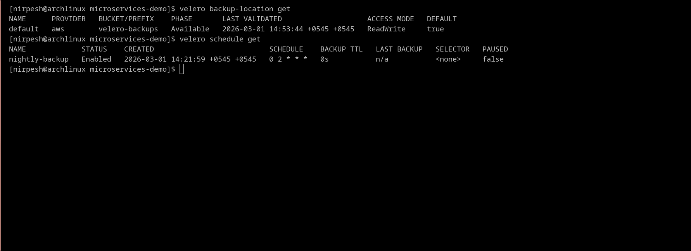
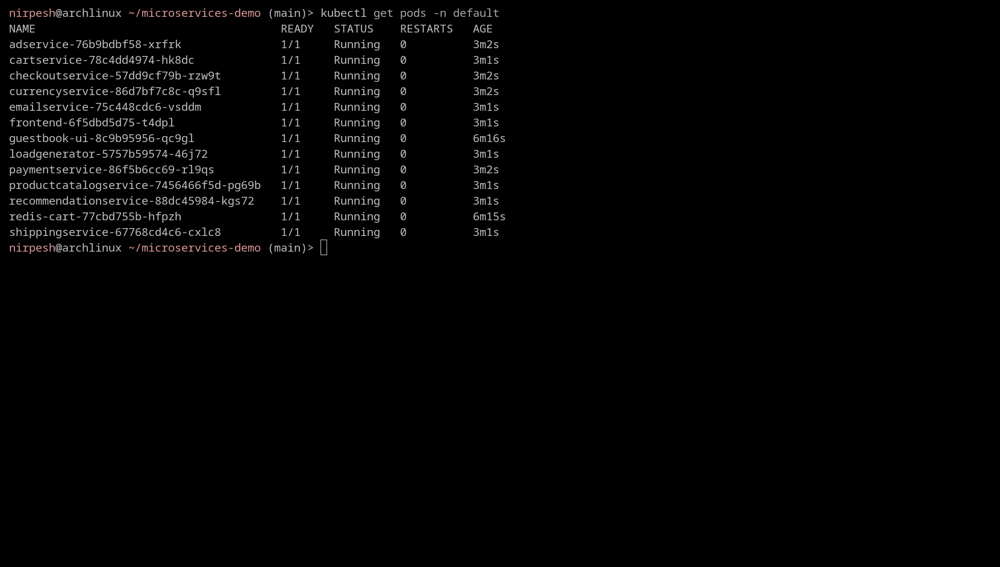

---

## Real-World SRE Challenges & Troubleshooting
Building this cross-cloud architecture involved solving severe edge cases:

* **Cross-Cloud Topology Complexity:** Bootstrapping an Azure worker node to an Oracle control plane required precise firewall engineering and IP routing configurations to ensure the Kubelet on Azure could reliably communicate with the Oracle API server without dropping packets.
* **The Supply Chain Failure (Bitnami MinIO):** During the DR setup, Helm pulls failed. Investigation revealed Bitnami had deprecated the `latest` tag for their free-tier MinIO charts. **Solution:** I ripped out the broken dependency and re-engineered the deployment using the official `minio/minio` Helm chart, bypassing the public registry limits.
* **The GitOps "Ghost Pod" Loop:** During a rollout, a temporary Google commit tag (`0ea12af7`) was pulled, causing an `ImagePullBackOff` crash. Attempting to fix the pods imperatively via `kubectl` failed because ArgoCD's self-healing immediately overwrote manual fixes. **Solution:** I executed a surgical GitOps hotfix by updating the root `release/kubernetes-manifests.yaml` to hardcode the stable `v0.10.4` tags. ArgoCD instantly detected the correct state and healed the cluster declaratively.
* **GitHub Actions Permission Block:** While automating manifest updates, a bulk file-replace command accidentally modified a CI/CD workflow file inside the protected `.github/workflows` folder. When I tried to push the code, GitHub blocked it for security reasons. **Solution:** Instead of wiping the repository or generating risky overarching access tokens, I utilized `git checkout origin/main -- .github/` to surgically undo the changes only in the workflows directory. I then used `git commit --amend` to cleanly rewrite the Git history and successfully pushed the deployment fix.
